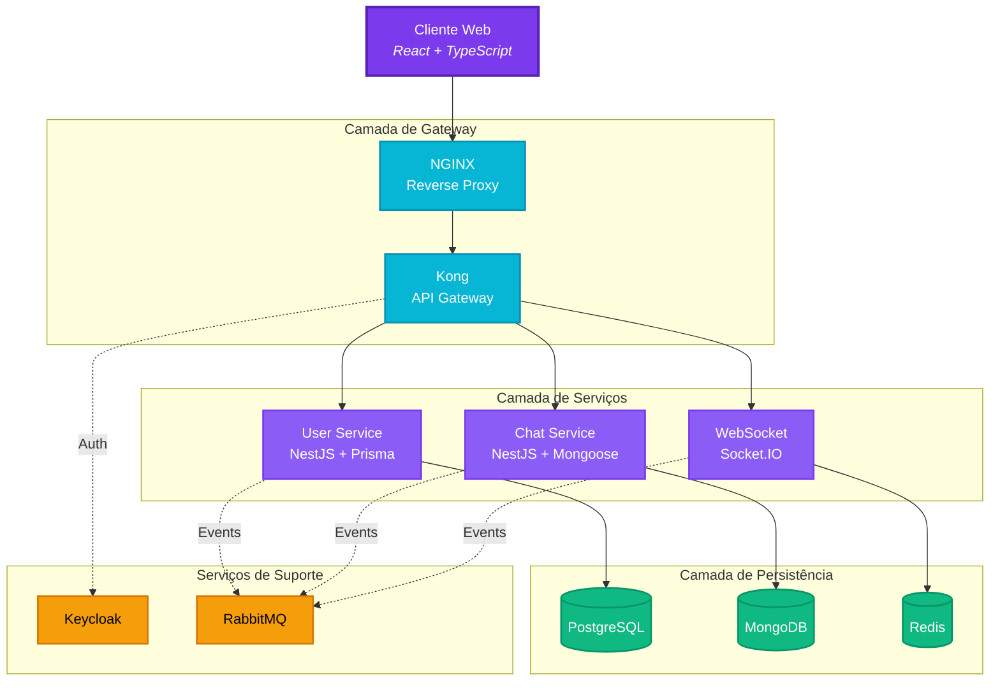

# Thread - Plataforma de Colaboração em Tempo Real


Sistema de chat em tempo real escalável construído com arquitetura moderna de microsserviços, utilizando NestJS no backend e totalmente containerizado com Docker.

## 📚 Sobre o Projeto

**Thread** é uma plataforma de chat em tempo real desenvolvida como **projeto de portfólio** para demonstrar proficiência em arquitetura de microsserviços moderna, engenharia Full Stack e práticas DevOps. O sistema implementa um ambiente de mensagens escalável e pronto para produção, com ênfase em type safety (TypeScript/NestJS), performance e automação de deploy.

## 📜 Sumário

- [Funcionalidades](#-funcionalidades)
- [Melhorias e Próximos Passos](#-melhorias-e-próximos-passos)
- [Arquitetura](#️-arquitetura)
- [Tecnologias Utilizadas](#-tecnologias-utilizadas)
- [Estrutura do Projeto](#-estrutura-do-projeto)
- [Como Executar](#-como-executar)
- [Observabilidade](#-observabilidade)
- [Documentação](#-documentação)
- [Serviços e Portas](#-serviços-e-portas)
- [API Endpoints](#-api-endpoints)
- [Áreas Administrativas](#-áreas-administrativas)
- [Histórico de Alterações](#-histórico-de-alterações)
- [Autores](#-autores)
- [Licença](#-licença)

## ✨ Funcionalidades

O projeto está em desenvolvimento e as seguintes funcionalidades estão planejadas:

- [ ] Autenticação e autorização de usuários com Keycloak.
- [ ] Gerenciamento de usuários, perfis e contatos.
- [ ] Criação e gerenciamento de salas de chat.
- [ ] Envio e recebimento de mensagens em tempo real.
- [ ] Notificações de mensagens e status de usuário.

## 🎯 Melhorias e Próximos Passos

- **Aprimorar a Observabilidade**:

  - [ ] Implementar **logging estruturado** (ex: JSON) em todos os microsserviços para facilitar a consulta e análise de logs.
  - [ ] Integrar o **Prometheus** para coletar métricas de aplicação (ex: latência de requisições, taxas de erro) e de sistema (ex: uso de CPU/memória dos contêineres).
  - [ ] Desenvolver dashboards no Grafana para monitorar as métricas do Prometheus e configurar alertas para condições críticas.
  - [ ] Implementar **tracing distribuído** (ex: com Jaeger ou OpenTelemetry) para rastrear requisições através dos múltiplos serviços.

- **Segurança e Qualidade**:

  - [ ] Aumentar a cobertura de testes (unitários, integração e E2E) para garantir a estabilidade do sistema.
  - [ ] Configurar um pipeline de **CI/CD** (Integração e Entrega Contínua) para automatizar o build, testes e deploy das aplicações.
  - [ ] Implementar políticas de segurança mais robustas no API Gateway (Kong), como rate limiting e autenticação refinada.

- **Funcionalidades do Core**:
  - [ ] Finalizar a implementação das funcionalidades principais do chat, como gerenciamento de contatos, salas privadas e notificações.
  - [ ] Desenvolver a interface de usuário no frontend para interagir com todas as funcionalidades do backend.

## 🏗️ Arquitetura

O projeto é composto pelos seguintes serviços:



### Descrição dos Componentes

- **nginx**: Atua como um proxy reverso para os outros serviços e serve o frontend.
- **frontend**: Aplicação web construída com React, TypeScript e Tailwind CSS.
- **kong**: API Gateway para gerenciar as rotas e o acesso aos microsserviços.
- **keycloak**: Lida com a autenticação e autorização de usuários.
- **user-service**: Microsserviço para gerenciar usuários, perfis e contatos.
- **chat-service**: Microsserviço para gerenciar as salas de chat e mensagens.
- **websocket-service**: Lida com a comunicação em tempo real usando WebSockets.
- **postgresql**: Banco de dados relacional para o `user-service`.
- **mongodb**: Banco de dados NoSQL para o `chat-service`.
- **rabbitmq**: Message broker para a comunicação assíncrona entre os serviços.

## 🛠️ Tecnologias Utilizadas

### Stack Atual (Em Transição)

- **Frontend**: React, TypeScript, Tailwind CSS
- **Backend**: Python, Flask, Flask-RESTX, Flask-SocketIO _(sendo migrado para NestJS)_
- **Banco de Dados**: PostgreSQL, MongoDB
- **Mensageria**: RabbitMQ
- **Autenticação**: Keycloak
- **API Gateway**: Kong
- **Containerização**: Docker, Docker Compose
- **Observabilidade**: Grafana, Loki, Promtail
- **Comunicação em Tempo Real**: WebSockets
- **Servidor WSGI**: Gunicorn, Eventlet

### Stack Futura (Planejada)

- **Frontend**: React, TypeScript, Tailwind CSS
- **Backend**: **NestJS**, TypeScript, Socket.IO
- **ORM**: **Prisma** (PostgreSQL), **Mongoose** (MongoDB)
- **Banco de Dados**: PostgreSQL, MongoDB, **Redis** (cache)
- **Mensageria**: RabbitMQ
- **Autenticação**: Keycloak (OAuth2/JWT)
- **API Gateway**: Kong
- **Containerização**: Docker (multi-stage builds), Docker Compose
- **Observabilidade**: Grafana, Loki, Promtail, **Prometheus**
- **CI/CD**: GitHub Actions
- **IaC**: Terraform (AWS) ou Kubernetes

## 📁 Estrutura do Projeto

```
.
├── docker
│   └── docker-compose.yaml
├── frontend
│   ├── public
│   └── src
│       └── components
├── kong
│   ├── config
│   │   └── kong.yaml
│   └── docker
│       └── Dockerfile
├── microservices
│   ├── chat-service
│   │   ├── docker
│   │   │   └── Dockerfile
│   │   └── src
│   ├── users-service
│   │   ├── docker
│   │   │   └── Dockerfile
│   │   └── src
│   └── websocket-service
│       ├── docker
│       │   └── Dockerfile
│       └── src
├── nginx
│   ├── config
│   │   └── nginx.conf
│   └── docker
│       └── Dockerfile
├── observability
│   ├── grafana
│   │   └── provisioning
│   │       └── datasources
│   │           └── loki.yml
│   ├── logs
│   └── promtail
│       └── config.yml
├── public
│   ├── arquitetura-sistema.jpeg
│   └── thread-logo.png
├── index.html
└── README.md
```

## 🚀 Como Executar

### Pré-requisitos

- Docker
- Docker Compose

### Configuração e Execução

1. **Clone o repositório:**

   ```bash
   git clone <repository-url>
   cd <nome-da-pasta-do-projeto>
   ```

2. **Configure as Variáveis de Ambiente:**
   O projeto utiliza um arquivo `.env` para configurar as variáveis de ambiente. Crie uma cópia do arquivo de exemplo e altere os valores conforme necessário.

   ```bash
   cp .env.example .env
   ```

3. **Inicie os serviços:**

   ```bash
   docker-compose -f docker/docker-compose.yaml up -d --build
   ```

A aplicação estará disponível em `http://localhost`.

## 🔭 Observabilidade

O projeto utiliza o stack **Grafana + Loki + Promtail** para observabilidade de logs.

- **Promtail**: Coleta os logs dos arquivos gerados por cada serviço.
- **Loki**: Armazena e indexa os logs coletados.
- **Grafana**: Permite visualizar, consultar e analisar os logs de forma centralizada.

Para acessar a interface do Grafana, utilize os seguintes dados:

- **URL**: `http://localhost:3000`
- **Usuário**: `admin`
- **Senha**: `admin`

Dentro do Grafana, o datasource do Loki já está pré-configurado, permitindo que você explore os logs de todos os serviços utilizando a linguagem de consulta **LogQL**.

## 📄 Documentação

Para mais detalhes sobre a arquitetura e o fluxo de dados do sistema, consulte os seguintes documentos:

- **[Fluxo de Dados](docs/fluxo-de-dados.md)**: Descreve como os dados fluem entre os diferentes microsserviços.
- **[Diagramas de Arquitetura](docs/diagrams.md)**: Contém diagramas que ilustram a arquitetura do sistema.
- **[Histórico de Alterações](CHANGELOG.md)**: Detalha todas as mudanças notáveis do projeto.
- **[Licença](LICENSE)**: Informações sobre a licença de uso do software.

## 📊 Serviços e Portas

| Serviço               | Porta | Descrição                                       |
| --------------------- | ----- | ----------------------------------------------- |
| **Frontend**          | 80    | Aplicação web (servida pelo Nginx)              |
| **nginx**             | 80    | Proxy reverso para todos os serviços            |
| **kong**              | 8000  | API Gateway                                     |
| **keycloak**          | 8080  | Servidor de autenticação                        |
| **grafana**           | 3000  | Interface de visualização de logs e métricas    |
| **loki**              | 3100  | Armazenamento de logs                           |
| **user-service**      | 3001  | Microsserviço de usuários                       |
| **chat-service**      | 3002  | Microsserviço de chat                           |
| **websocket-service** | 3003  | Serviço de WebSocket para comunicação real-time |
| **postgresql**        | 5432  | Banco de dados para `user-service`              |
| **mongodb**           | 27017 | Banco de dados para `chat-service`              |
| **rabbitmq**          | 15672 | Interface de gerenciamento do RabbitMQ          |

## 📡 API Endpoints

As rotas da API são gerenciadas pelo Kong API Gateway.

- **User Service**: `http://localhost/api/users`
- **Chat Service**: `http://localhost/api/chats`
- **WebSocket Service**: `ws://localhost/socket.io`

Para mais detalhes sobre os endpoints de cada serviço, consulte a documentação Swagger UI de cada um:

- **User Service Docs**: `http://localhost/api/chats/doc`
- **Chat Service Docs**: `http://localhost/api/chats/doc`
- **WebSocket Service AsyncAPI**: `http://localhost:3003/asyncapi` (Exposto pelo `asyncapi.yaml`)

## 🏛️ Áreas Administrativas

Para acessar as áreas administrativas dos serviços, utilize os seguintes endereços:

- **Keycloak**:

  - **URL**: `http://localhost/auth/`
  - **Usuário**: `admin`
  - **Senha**: `admin`

- **RabbitMQ**:

  - **URL**: `http://localhost/rabbitmq/`
  - **Usuário**: `guest`
  - **Senha**: `guest`

- **Grafana**:
  - **URL**: `http://localhost:3000`
  - **Usuário**: `admin`
  - **Senha**: `admin`

## 📜 Histórico de Alterações

Consulte o CHANGELOG.md para ver as mudanças notáveis em cada versão do projeto.

## ⚖️️ Licença

Este projeto está licenciado sob a Licença MIT.
