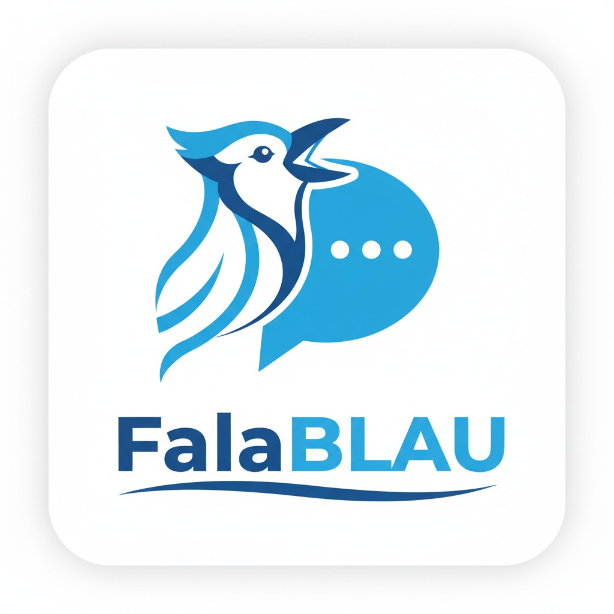
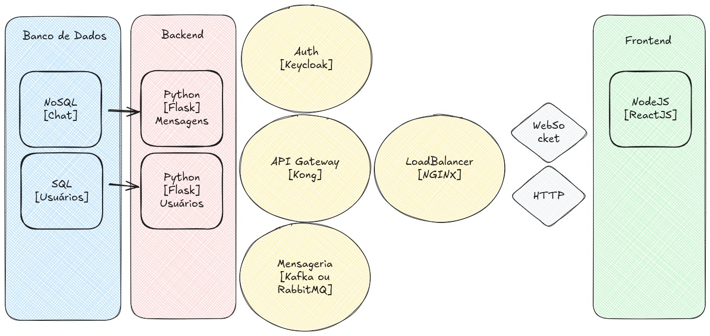

# FalaBLAU - Sistema de Chat em Tempo Real



Um sistema de chat em tempo real construído com arquitetura de microsserviços, utilizando Flask para o backend, e totalmente containerizado com Docker.



## 📚 Sobre o Projeto

Este projeto, denominado FalaBLAU, foi desenvolvido como trabalho de conclusão de curso (TCC) de pós-graduação. Ele visa demonstrar a implementação de um sistema de chat em tempo real utilizando uma arquitetura de microsserviços moderna e robusta.


## 📜 Sumário

- [Funcionalidades](#-funcionalidades)
- [Arquitetura](#️-arquitetura)
- [Tecnologias Utilizadas](#-tecnologias-utilizadas)
- [Estrutura do Projeto](#-estrutura-do-projeto)
- [Como Executar](#-como-executar)
- [Documentação](#-documentação)
- [Serviços e Portas](#-serviços-e-portas)
- [API Endpoints](#-api-endpoints)
- [Áreas Administrativas](#-áreas-administrativas)
- [Histórico de Alterações](#-histórico-de-alterações)
- [Autores](#-autores)
- [Licença](#-licença)

## ✨ Funcionalidades
O projeto está em desenvolvimento e as seguintes funcionalidades estão planejadas:

- [ ] Autenticação e autorização de usuários com Keycloak.
- [ ] Gerenciamento de usuários, perfis e contatos.
- [ ] Criação e gerenciamento de salas de chat.
- [ ] Envio e recebimento de mensagens em tempo real.
- [ ] Notificações de mensagens e status de usuário.

## 🎯 Melhorias e Próximos Passos

- **Implementar Logging Estruturado**:
  - [ ] Adicionar logging estruturado em todos os microsserviços (`user-service`, `chat-service`, `websocket-service`) para gerar logs em arquivos.
- **Configurar a Camada de Observabilidade**:
  - [ ] Configurar o Promtail para coletar logs de todos os microsserviços e do Nginx.
  - [ ] Criar dashboards no Grafana para visualizar e consultar os logs agregados pelo Loki.
  - [ ] Integrar o Prometheus para coletar métricas de aplicação (ex: latência de requisições, taxas de erro) e de sistema (ex: uso de CPU/memória dos contêineres).
  - [ ] Desenvolver dashboards no Grafana para monitorar as métricas do Prometheus.

## 🏗️ Arquitetura

O projeto é composto pelos seguintes serviços:

- **nginx**: Atua como um proxy reverso para os outros serviços e serve o frontend.
- **frontend**: Aplicação web construída com React, TypeScript e Tailwind CSS.
- **kong**: API Gateway para gerenciar as rotas e o acesso aos microsserviços.
- **keycloak**: Lida com a autenticação e autorização de usuários.
- **user-service**: Microsserviço para gerenciar usuários, perfis e contatos.
- **chat-service**: Microsserviço para gerenciar as salas de chat e mensagens.
- **websocket-service**: Lida com a comunicação em tempo real usando WebSockets.
- **postgresql**: Banco de dados relacional para o `user-service`.
- **mongodb**: Banco de dados NoSQL para o `chat-service`.
- **rabbitmq**: Message broker para a comunicação assíncrona entre os serviços.

## 🛠️ Tecnologias Utilizadas

- **Frontend**: React, TypeScript, Tailwind CSS
- **Backend**: Python, Flask, Flask-RESTX, Flask-SocketIO
- **Banco de Dados**: PostgreSQL, MongoDB
- **Mensageria**: RabbitMQ
- **Autenticação**: Keycloak
- **API Gateway**: Kong
- **Containerização**: Docker, Docker Compose
- **Comunicação em Tempo Real**: WebSockets
- **Servidor WSGI**: Gunicorn, Eventlet
- **Outros**: Pika (para RabbitMQ), Kombu, Psycopg2, PyMongo

## 📁 Estrutura do Projeto

```
.
├── docker
│   └── docker-compose.yaml
├── frontend
│   ├── public
│   │   └── index.html
│   ├── src
│   │   ├── components
│   │   │   ├── Chat.tsx
│   │   │   └── Login.tsx
│   │   ├── App.tsx
│   │   ├── index.css
│   │   ├── index.tsx
│   │   └── reportWebVitals.ts
│   ├── .env.example
│   ├── package.json
│   ├── tsconfig.json
│   └── Dockerfile
├── kong
│   ├── config
│   │   └── kong.yaml
│   └── docker
│       └── Dockerfile
├── microservices
│   ├── chat-service
│   │   ├── docker
│   │   │   └── Dockerfile
│   │   └── src
│   ├── users-service
│   │   ├── docker
│   │   │   └── Dockerfile
│   │   └── src
│   └── websocket-service
│       ├── docker
│       │   └── Dockerfile
│       └── src
├── nginx
│   ├── config
│   │   └── nginx.conf
│   └── docker
│       └── Dockerfile
├── public
│   ├── arquitetura-sistema.jpeg
│   └── fala-blau.jpeg
├── index.html
└── README.md
```

## 🚀 Como Executar

### Pré-requisitos

- Docker
- Docker Compose

### Configuração e Execução

1. **Clone o repositório:**

   ```bash
   git clone <repository-url>
   cd <nome-da-pasta-do-projeto>
   ```

2. **Configure as Variáveis de Ambiente:**
   O projeto utiliza um arquivo `.env` para configurar as variáveis de ambiente. Crie uma cópia do arquivo de exemplo e altere os valores conforme necessário.
   ```bash
   cp .env.example .env
   ```

3. **Inicie os serviços:**

   ```bash
   docker-compose -f docker/docker-compose.yaml up -d --build
   ```

A aplicação estará disponível em `http://localhost`.

## 📄 Documentação

Para mais detalhes sobre a arquitetura e o fluxo de dados do sistema, consulte os seguintes documentos:

- **[Fluxo de Dados](docs/fluxo-de-dados.md)**: Descreve como os dados fluem entre os diferentes microsserviços.
- **[Diagramas de Arquitetura](docs/diagrams.md)**: Contém diagramas que ilustram a arquitetura do sistema.
- **[Histórico de Alterações](CHANGELOG.md)**: Detalha todas as mudanças notáveis do projeto.
- **[Licença](LICENSE)**: Informações sobre a licença de uso do software.

## 📊 Serviços e Portas

| Serviço             | Porta      | Descrição                                      |
| ------------------- | ---------- | ---------------------------------------------- |
| **Frontend**        | 80         | Aplicação web (servida pelo Nginx)             |
| **nginx**           | 80         | Proxy reverso para todos os serviços           |
| **kong**            | 8000       | API Gateway                                    |
| **keycloak**        | 8080       | Servidor de autenticação                       |
| **user-service**    | 3001       | Microsserviço de usuários                      |
| **chat-service**    | 3002       | Microsserviço de chat                          |
| **websocket-service** | 3003       | Serviço de WebSocket para comunicação real-time|

## 📡 API Endpoints

As rotas da API são gerenciadas pelo Kong API Gateway.

- **User Service**: `http://localhost/api/users`
- **Chat Service**: `http://localhost/api/chats`
- **WebSocket Service**: `ws://localhost/socket.io`

Para mais detalhes sobre os endpoints de cada serviço, consulte a documentação Swagger UI de cada um:

- **User Service Docs**: `http://localhost/api/chats/doc`
- **Chat Service Docs**: `http://localhost/api/chats/doc`
- **WebSocket Service AsyncAPI**: `http://localhost:3003/asyncapi` (Exposto pelo `asyncapi.yaml`)

## 🏛️ Áreas Administrativas

Para acessar as áreas administrativas dos serviços, utilize os seguintes endereços:

- **Keycloak**:
  - **URL**: `http://localhost/auth/`
  - **Usuário**: `admin`
  - **Senha**: `admin`

- **RabbitMQ**:
  - **URL**: `http://localhost/rabbitmq/`
  - **Usuário**: `guest`
  - **Senha**: `guest`

## 📜 Histórico de Alterações

Consulte o CHANGELOG.md para ver as mudanças notáveis em cada versão do projeto.

## ⚖️️ Licença

Este projeto está licenciado sob a Licença MIT.

## 👥 Autores

Este projeto foi desenvolvido por:

- **Jefferson Sant'ana Galvão** - [@hudjinn](https://github.com/hudjinn)
- **Victor Adler** - [@victoradler](https://github.com/victoradler)
- **Thiago Lima** - [@Thiagoldo](https://github.com/Thiagoldo)