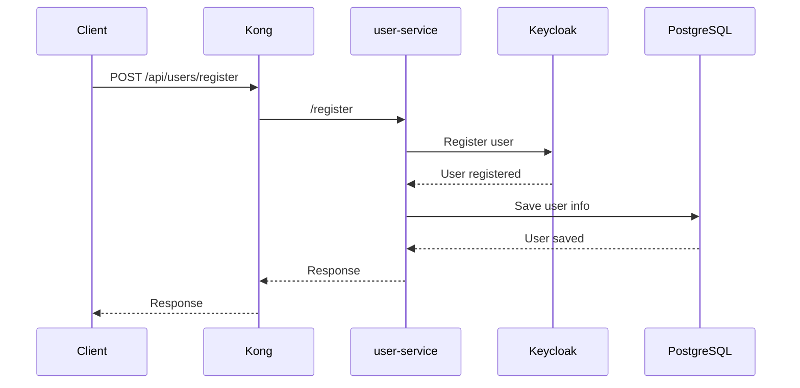
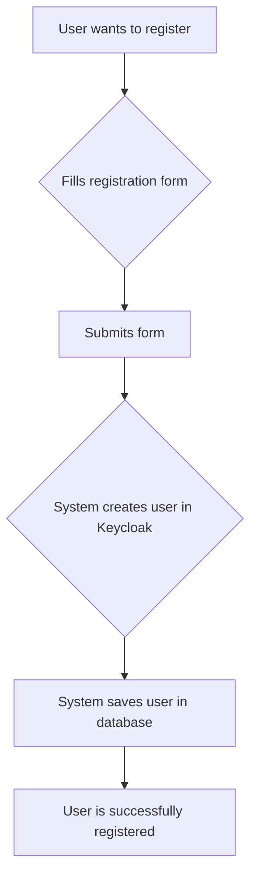
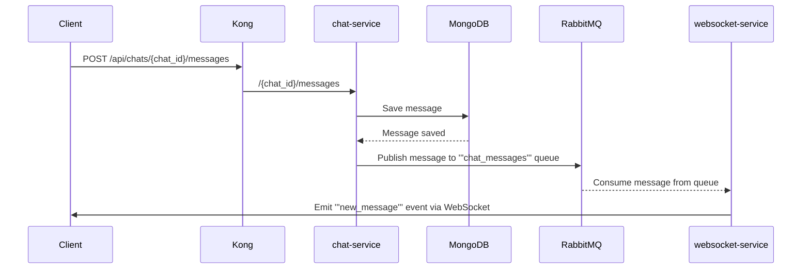
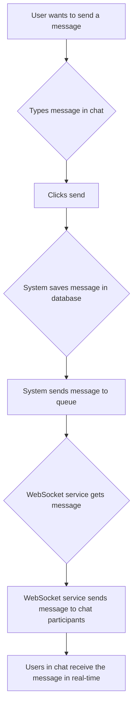
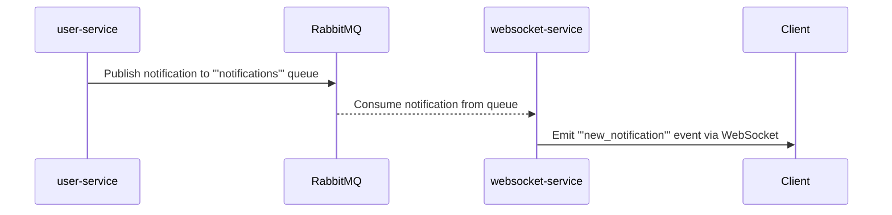
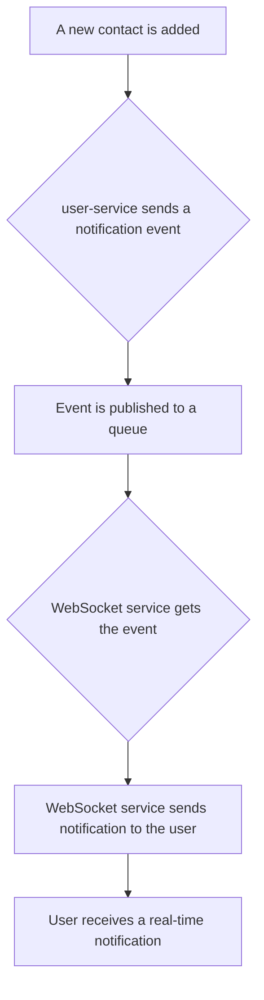
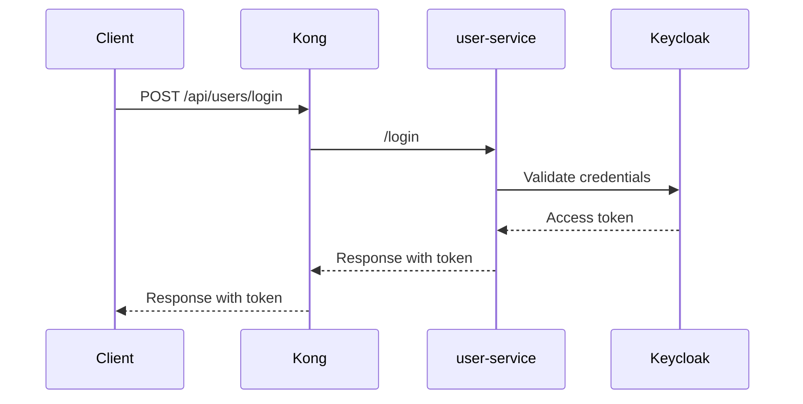
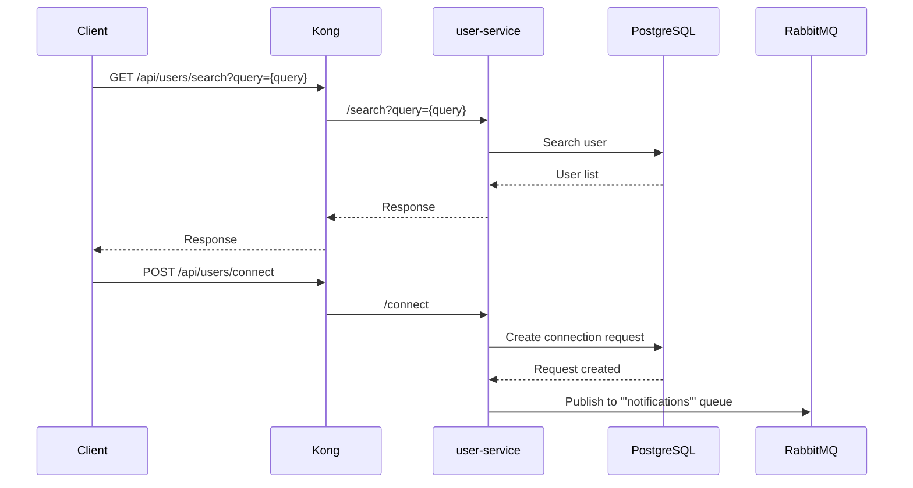
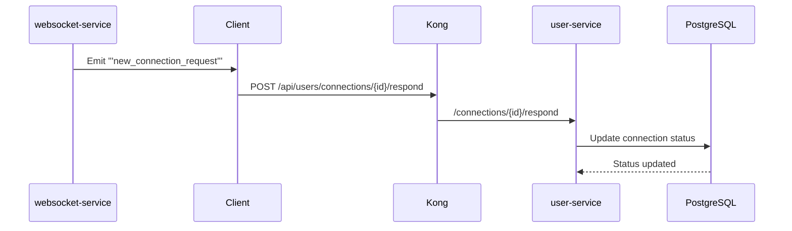
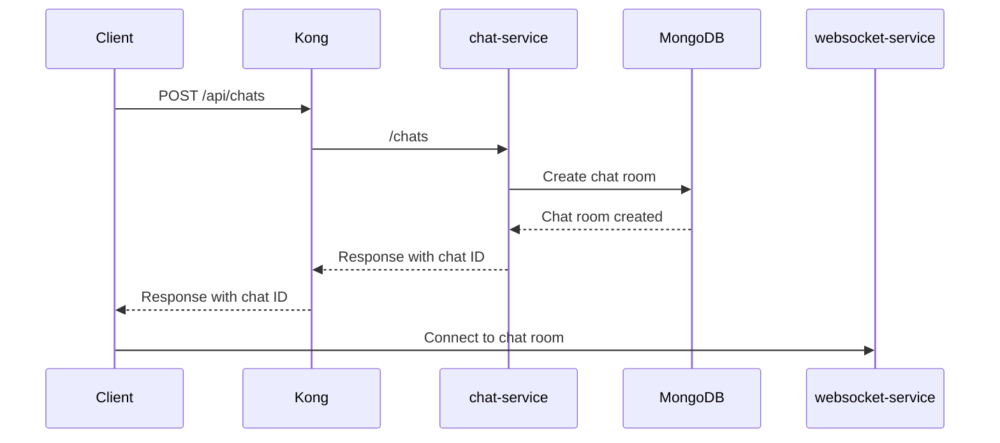

# Diagrams

## 1. User Registration and Authentication

### Data Flow Diagram

### User Story

## 2. Sending a Chat Message

### Data Flow Diagram

### User Story

## 3. Real-time Notifications

### Data Flow Diagram

### User Story

## 4. User Login

### Data Flow Diagram

## 5. Search and Connect with User

### Data Flow Diagram

## 6. Connection Request Notification

### Data Flow Diagram

## 7. Start a Chat

### Data Flow Diagram

